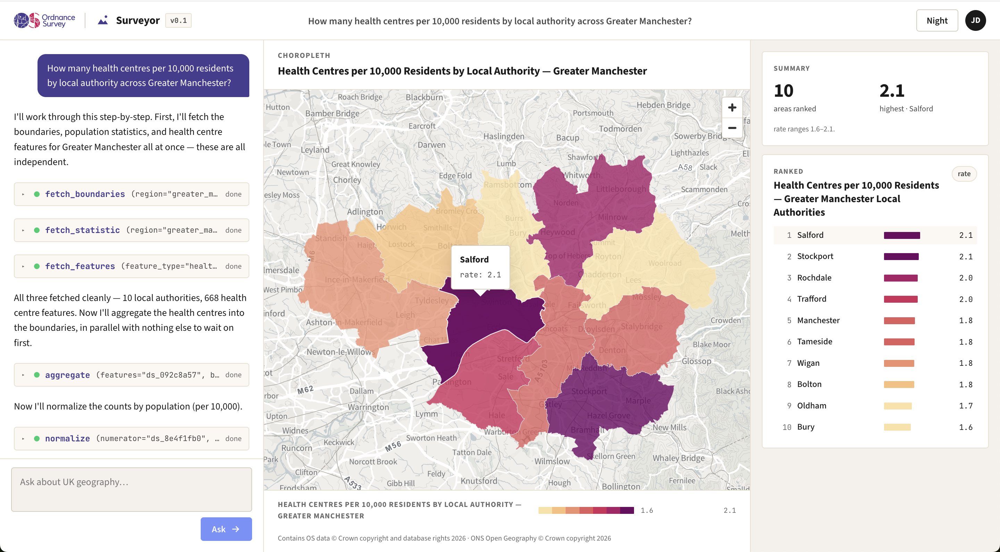

# Surveyor

**An agentic chat interface to UK national geospatial data.** Ask a question about Britain in plain English — *"How many health centres per 10,000 residents, by local authority, across Greater Manchester?"* — and Surveyor's agent composes a sequence of tool calls over live Ordnance Survey and ONS data, shows its work as it goes, and renders the answer as a choropleth map and a ranked chart.



**▶ Watch the demo:** [the Surveyor UI in action](https://youtu.be/By9EBr5duwA)

Surveyor was built live, in the open, at the Geovation AI Agents workshop in May 2026. That makes this repository two things at once, and you can read it as either:

- **As an application** — a runnable v0.1 of a general-purpose agentic GIS tool. The demo answers a curated set of questions today — see [Scope and limitations](#scope-and-limitations). Jump to [Running Surveyor](#running-surveyor).
- **As a build-in-the-open walkthrough** — the whole build, phase by phase, with every brief, mockup, decision, and recorded session preserved. Start with [Follow the build](#follow-the-build).

## Running Surveyor

There are two ways to run it: a browser UI and a command line. Both drive the *same* agent loop — the web layer only changes where the trace is rendered.

### Prerequisites

- Python 3.11+ with [uv](https://docs.astral.sh/uv/)
- Node 18+ (for the web UI)
- Two API keys (below)

### API keys

Two keys are needed, both kept server-side and never sent to the browser. Put them in a git-ignored `.env.dev`, or export them into the environment:

```
ANTHROPIC_API_KEY=...   # the agent loop
OS_DATA_HUB_KEY=...     # OS NGD feature fetches and the map basemap (a premium API)
```

ONS Nomis and the ONS/MHCLG ArcGIS services need no key. The agent runs on `claude-sonnet-4-6` by default; override it with `SURVEYOR_MODEL`. If the OS Vector Tile API lives on a different OS Data Hub project, set `OS_MAPS_API_KEY` for the basemap specifically. Without a working OS key the national, stat-only questions still run — the choropleth simply draws over a plain background, and the UI says so.

### The web UI

```bash
uv sync                 # install backend dependencies into a local .venv
./scripts/dev.sh        # uvicorn :8000 + Vite :5173  →  http://localhost:5173
```

Open the Vite URL, ask a question (or pick a suggestion), and watch the trace stream into the chat as the choropleth and ranked chart build. Vite proxies `/api/*` to the backend, so it is one origin in the browser. To run the two processes by hand instead, start `uv run uvicorn surveyor.app.main:app --reload --port 8000` and `cd web && npm install && npm run dev` separately.

To serve everything as a single process — FastAPI hosts the built frontend:

```bash
cd web && npm run build                              # emits web/dist
uv run uvicorn surveyor.app.main:app --port 8000     # serves the API + web/dist at /
```

### The command line

The same agent, printing its trace to the terminal:

```bash
uv sync
uv run python -m surveyor "How many health centres per 10,000 residents by local authority across Greater Manchester?"
uv run python -m surveyor "How many health centres in the West Midlands are within 800m of a library?"
uv run python -m surveyor "Population by local authority in England"
```

It prints the whole trace — every tool call, the small descriptor each returns, the render instructions for the map and chart, and a short written answer. Add `--dump-dir out/` to also write each resulting dataset to disk for inspection.

Per-tool smoke checks, each running one slice live against the real APIs:

```bash
uv run python -m scripts.try_boundaries
uv run python -m scripts.try_statistic
uv run python -m scripts.try_features      # needs OS_DATA_HUB_KEY
uv run python -m scripts.try_analysis      # the headline analysis chain, no model call
```

## How it works

- A hand-rolled Anthropic tool-use loop on the raw SDK — no agent framework.
- The agent has three kinds of tool: **fetch** (boundaries, statistics, OS features), six composable **analysis** operations (filter, aggregate, normalize, rank, relate, attach), and three **render** tools (choropleth, chart, points). A composable operation set, not a fixed pipeline — the agent assembles the chain that fits the question.
- Tools exchange server-side **dataset handles**, not raw data. The model passes small descriptors around while the heavy GeoJSON and tables stay server-side, fetched only when something needs drawing.
- Three source clients sit behind the fetch tools: ONS/MHCLG ArcGIS (boundaries), ONS Nomis (statistics), and OS NGD (features).
- The loop streams its trace through a **swappable event sink**. The CLI sink prints it; the SSE sink streams it to the browser. The loop, tools, and data model are identical either way — only the sink changes.

For the binding decisions and the reasoning behind them, see [`docs/02-architecture.md`](./docs/02-architecture.md).

### The HTTP surface

- `POST /api/query` `{question}` → a `text/event-stream` of the agent's events, one vocabulary shared with the CLI sink: `status`, `message`, `tool_call`, `tool_result`, `view` (a render instruction — a `choropleth` geo handle, a `chart` table handle, or a `points` geo handle drawn as a marker overlay), `error`, and `done`.
- `GET /api/datasets/{handle}` → the full GeoJSON or table behind a handle, for the map and chart to draw.
- `GET /api/basemap/*` → the OS Vector Tile proxy, with the key injected server-side.

The frontend reads the stream with `fetch` plus a `ReadableStream` reader (not `EventSource`, which is GET-only) and fetches each `view`'s handle to draw it.

## Follow the build

Surveyor is built across eight phases. Each of phases 1 through 6 leaves a durable artifact and a recorded session, shipped as a single pull request that is reviewed before it merges — so you can clone this repo, read the commit log, and walk the whole build yourself. Phases 0 and 7 are the live framing around the block.

0. Frame · 1. Idea-gen · 2. UI design · 3. Architecture · 4. Build phase 1 · 5. Build phase 2 · 6. Extension · 7. Wrap

- [`WALKTHROUGH.md`](./WALKTHROUGH.md) — the index. One section per phase, linking the pull request, the recorded session, and the commits that carry the story.
- [Project board](https://github.com/users/johnx25bd/projects/8) — where each phase moves from Backlog to Published.
- [Milestone: Workshop 2026-05-27](https://github.com/johnx25bd/surveyor-demo/milestone/1) — every phase issue is tracked against it.

When this started, what Surveyor *was* had not been decided. That was deliberate: the concept, the stack, the UI, and the rough edges all emerged across the phases, captured here as they happened. We record the story; we don't plant it.

## Scope and limitations

**General-purpose by design, curated for the demo.** Surveyor is built as an extensible, general-purpose agentic GIS tool: composable fetch and analysis operations over live national data, with no hard-coded pipeline. The v0.1 demo runs that engine on a hand-verified capability manifest — a curated set of places, datasets, fields, and feature types (health-centre provision across Greater Manchester, population by local authority, and more) — which keeps the walkthrough fast and every query valid. Ask outside the curated set and it declines rather than guess. Opening the manifest to the full UK data space — runtime capability discovery, and resolving any place you name — is the planned next step, documented in [#13](https://github.com/johnx25bd/surveyor-demo/issues/13) and [#15](https://github.com/johnx25bd/surveyor-demo/issues/15).

v0.1 is a single-instance prototype — one in-memory dataset store, no auth — and the three-pane layout is built for a wide desktop screen, stacking below ~820px. OS NGD caps feature fetches at 100 per page, which makes feature-aggregation questions regional rather than national; stat-only questions run nationally. See [`docs/05-phase5-review.md`](./docs/05-phase5-review.md) for the full review findings and what's deferred before a public deployment.
